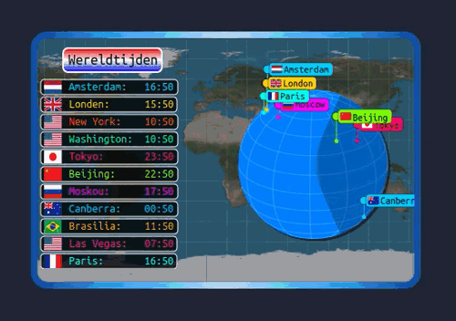

# World Clock Conky

**World Clock Conky** is a visually appealing and highly customizable Conky widget that displays world clocks using Cairo graphics. This widget includes features such as drawing time zones, city flags[...]

## Features

- 🌍 **Interactive Rotating Globe**: A 3D globe that rotates and displays city markers dynamically.
- 🕒 **World Clocks**: Displays the current time in various global time zones.
- 🚩 **Country Flags**: Shows the corresponding flag of each displayed city.
- 🎨 **Customizable Design**: Easily adjust colors, fonts, and other visual settings.
- ⚡ **Optimized Performance**: Lightweight and efficient, designed to minimize system resource usage.

## Preview



## Dependencies

- **Conky**: The system monitor used to display the widget.
- **Lua**: The scripting language used for customization and functionality.
- **Cairo Graphics Library**: Used for rendering the interactive globe and other graphical elements.

## Installation


Follow these steps to install and set up the World Clock Conky widget:

### 1. Install Conky
Make sure Conky is installed on your system. Use the following commands to install it:

- **On Ubuntu/Debian**:
  ```bash
  sudo apt update
  sudo apt install conky-all
  ```

- **On Arch Linux**:
  ```bash
  sudo pacman -S conky-cairo
  ```

### 2. Clone the Repository
Clone this repository to your local machine:
```bash
git clone https://github.com/wim66/World-Clock-Conky.git
cd World-Clock-Conky
```

## Customization

You can customize the widget by editing the following files:

- **`scripts/text.lua`**  
  - Add, remove, or change cities and their time zones in the `world_clocks` table.
  - Adjust colors, transparency, and assign a flag image per city.
  - Change the scroll speed (how fast the cities rotate in the display).
  - Modify layout and style for headers and labels, including fonts and gradients.

- **`scripts/layout.lua`**  
  - Adjust the background, borders, and overall layout of the widget.
  - Choose a border color scheme by setting `my_box_colour` to one of the options defined in `scripts/border_colour_schemes.lua`.

- **`scripts/border_colour_schemes.lua`**  
  - Edit or add your own border color gradients for even more visual customization.

## License

This project is licensed under the MIT License. See the [LICENSE](LICENSE) file for details.

## Author

Developed by [@wim66](https://github.com/wim66).
